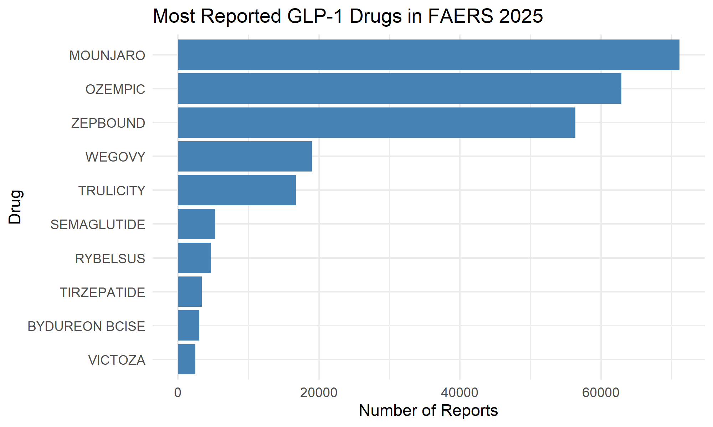
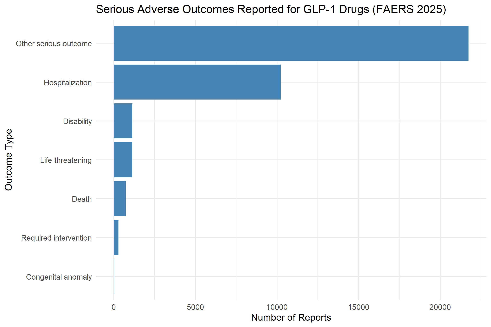
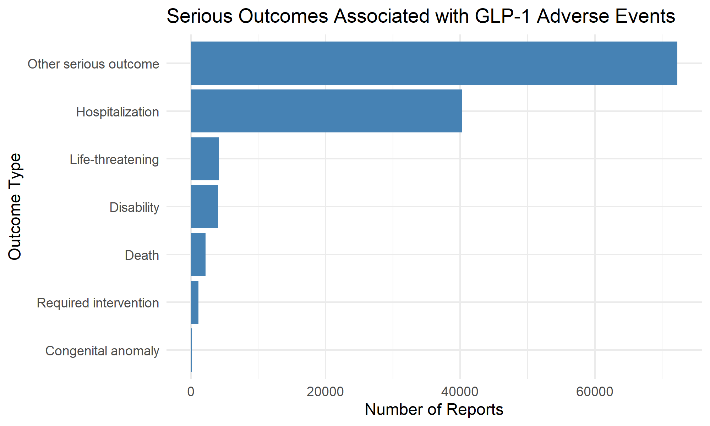
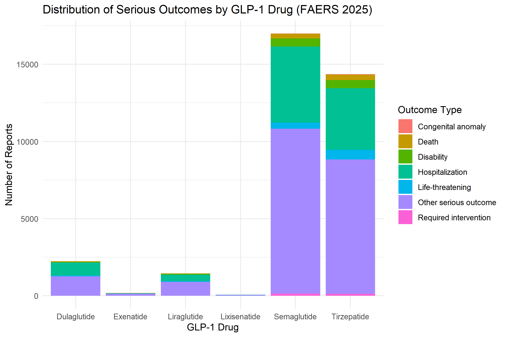
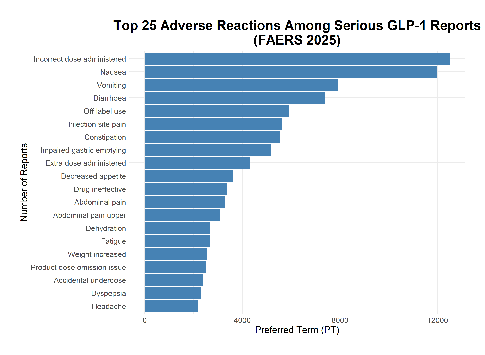
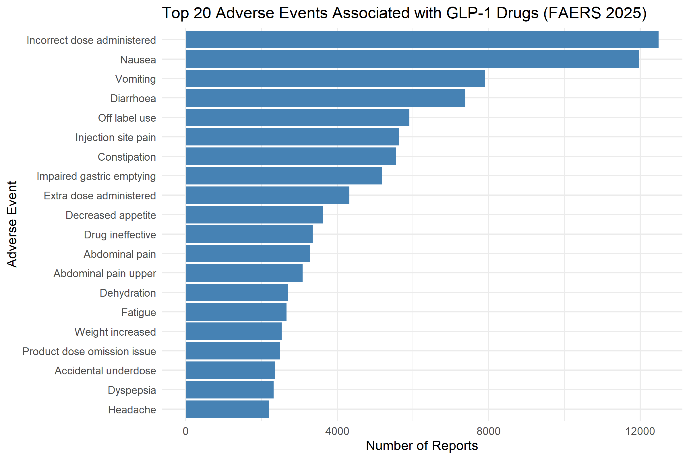
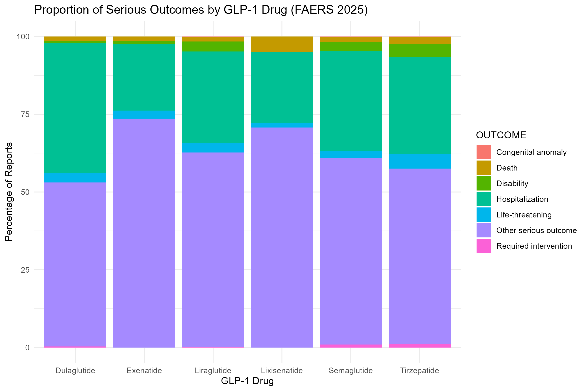

# GLP-1 Pharmacovigilance Analysis Using FDA FAERS Data

## Overview

This project analyzes **serious adverse events associated with GLP-1 receptor agonists** using the **FDA Adverse Event Reporting System (FAERS)** database.

GLP-1 receptor agonists such as **semaglutide, liraglutide, dulaglutide, exenatide, lixisenatide, and tirzepatide** are widely prescribed for the treatment of **type 2 diabetes and obesity**. These medications improve glycemic control by stimulating insulin secretion, suppressing glucagon release, and slowing gastric emptying.

Because the use of GLP-1 therapies has increased rapidly worldwide, monitoring their **real-world safety profile** has become increasingly important. Pharmacovigilance databases such as FAERS provide valuable information about adverse drug reactions reported in clinical practice.

This project conducts a **retrospective pharmacovigilance analysis of FAERS reports from 2025 (Q1–Q4)** to identify patterns of adverse events and serious clinical outcomes associated with GLP-1 receptor agonists.

---

## Project Highlights

• Analyzed **250,449 FAERS adverse event reports** from 2025 (Q1–Q4)

• Identified **124,062 serious adverse event reports** associated with GLP-1 receptor agonists

• Conducted **retrospective pharmacovigilance analysis** using the FDA FAERS database

• Identified **top adverse reactions**, including nausea, vomiting, and impaired gastric emptying

• Examined **serious clinical outcomes** such as hospitalization, life-threatening events, and death

• Compared **adverse event patterns across GLP-1 medications** including semaglutide, tirzepatide, dulaglutide, and liraglutide

• Produced **7 data visualizations** to illustrate adverse event distributions and drug-specific reporting patterns

• Performed the full workflow using **R, ggplot2, and FAERS public-use data**

---

# Study Aim

To describe and compare **serious adverse events reported for GLP-1 receptor agonists** in the FAERS database and explore whether **drug type and report characteristics** are associated with serious outcomes.

---

# Research Questions

**RQ1:**  
What types of serious outcomes (hospitalization, death, life-threatening events, etc.) are reported for GLP-1 receptor agonists in FAERS, and how frequently does each outcome occur?

**RQ2:**  
Which adverse reactions are most frequently associated with serious outcomes among GLP-1 drug reports?

**RQ3:**  
Do patterns of serious adverse events differ across individual GLP-1 medications?

---

# Hypotheses

**H1:**  
Hospitalization will be the most frequently reported serious outcome among GLP-1 adverse event reports.

**H2:**  
The distribution of serious adverse events will differ across GLP-1 drugs.

---

# Dataset

**Source:** FDA Adverse Event Reporting System (FAERS)

This analysis used FAERS public datasets from:

**2025 Q1 – 2025 Q4**

FAERS is a spontaneous reporting system used by the FDA for **post-marketing drug safety monitoring**.

Reports are submitted by:

- Healthcare professionals  
- Pharmaceutical manufacturers  
- Patients and consumers  

Because FAERS contains millions of adverse event reports from diverse patient populations, it is widely used for **pharmacovigilance and epidemiologic drug safety research**.

---

# Data Summary

| Metric | Value |
|------|------|
| FAERS data used | 2025 Q1 – Q4 |
| Total reports analyzed | 250,449 |
| Serious reports | 124,062 |
| Non-serious reports | 126,387 |
| Most reported GLP-1 drug | Mounjaro |
| Second most reported drug | Ozempic |
| Most common adverse reaction | Incorrect dose administered |
| Second most common reaction | Nausea |
| Most common serious outcome | Other serious outcome |
| Second most common serious outcome | Hospitalization |

These summary statistics provide an overview of the FAERS dataset analyzed in this project.

---

# Methods

The analysis was conducted using **R**.

Key analytical steps included:

1. Importing FAERS quarterly datasets (2025 Q1–Q4)
2. Cleaning and merging FAERS files
3. Filtering reports involving GLP-1 receptor agonists
4. Removing duplicate case reports
5. Extracting adverse event preferred terms (PT)
6. Identifying serious outcomes
7. Generating descriptive statistics
8. Visualizing reporting patterns using **ggplot2**

This workflow allows identification of **commonly reported adverse reactions and serious clinical outcomes** associated with GLP-1 medications.

---

# Key Findings

The analysis identified several important pharmacovigilance patterns:

• Gastrointestinal symptoms such as **nausea, vomiting, and diarrhea** were among the most frequently reported adverse reactions.

• The most commonly reported serious outcomes were **other medically significant outcomes and hospitalization**.

• **Life-threatening events, disability, and death were relatively uncommon** compared with other serious outcomes.

• The largest number of adverse event reports were associated with **semaglutide and tirzepatide products**, reflecting their widespread clinical use.

These findings are consistent with previously published pharmacovigilance studies examining GLP-1 receptor agonists.

---

# Data Visualizations

## Most Reported GLP-1 Drugs in FAERS

---

## Distribution of Serious Adverse Outcomes

---

## Serious Outcomes Associated with GLP-1 Adverse Events

---

## Distribution of Serious Outcomes by GLP-1 Drug

---

## Top 25 Adverse Reactions Among Serious Reports

---

## Top 20 Adverse Events Associated with GLP-1 Drugs

---

## Proportion of Serious Outcomes by Drug

---

# Limitations

FAERS is a spontaneous reporting system and therefore has several limitations:

- Underreporting of adverse events
- Reporting bias and stimulated reporting
- Duplicate or incomplete reports
- Lack of denominator data for drug exposure
- Inability to establish causal relationships

Therefore, results should be interpreted as **reporting patterns rather than true incidence rates**.

---

# Tools Used

- R
- data.table
- ggplot2
- Excel
- FDA FAERS Public Use Data

---

# Author

**Asmita Thapa**  
Master of Public Health (MPH)  
Epidemiology & Biostatistics

---

# Project Purpose

This project demonstrates:

- Pharmacovigilance analysis using **FAERS drug safety data**
- Handling of **large public health datasets**
- Epidemiologic analysis using **R**
- Data visualization for **drug safety research**
- Reproducible public health research workflows

  
